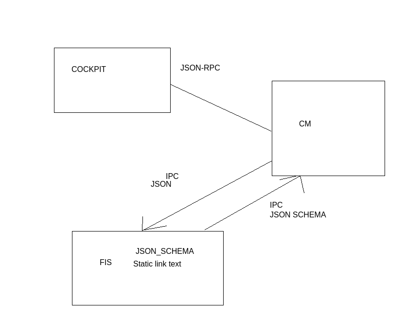

# Configuration manager ( confman )

## Description 

A running service responsible for tracking current configuration
accepting configuration changes and notifing parties of configuration
changes.

## High level diagram of compoenents ( fis example service )


## Features
- Log configuration changes
- Make configuration available on internal ipc for services
- Make configuration management available on json-rpc ( cockpit f.e. )
- Services declare configuration fields, type, limits and defaults to configuration manager over ipc.
- Configuration to be persistent between reboots
- Eazy backup of configuration
- Eazy restore of configureation

## Play confman interface
```cpp
// Service configuration parameters
confman.register_executable(id, json_schema, callback);

confman.setSchema("connections.1.foo", json_schema, callback)

// IPC Mapping registration
confman.register_slots(slots);
confman.regetier_signals(signals);

confman.list_executables();
confman.getParameter(exectuable_id);
Communication over local socet t.d. /var/run/skaginn3x/confman.sock
```


## Inital implementation of storage and backup
Will utilize file level json files.
Backups will be implemented by joining the relevant json files
and downloading a single large file.

```json
files: [
    "executable": "fis",
    "executable_id": "left_fis"
    "file_contents": "******",
]
```

## Log changes to configuration
In the first iteration this can be as simple
as printing the current json and the json
to bo applied.

```
==================> Configuration changed from 
JSON BLOB
==================< TO 
JSON BLOB
==================<>
```