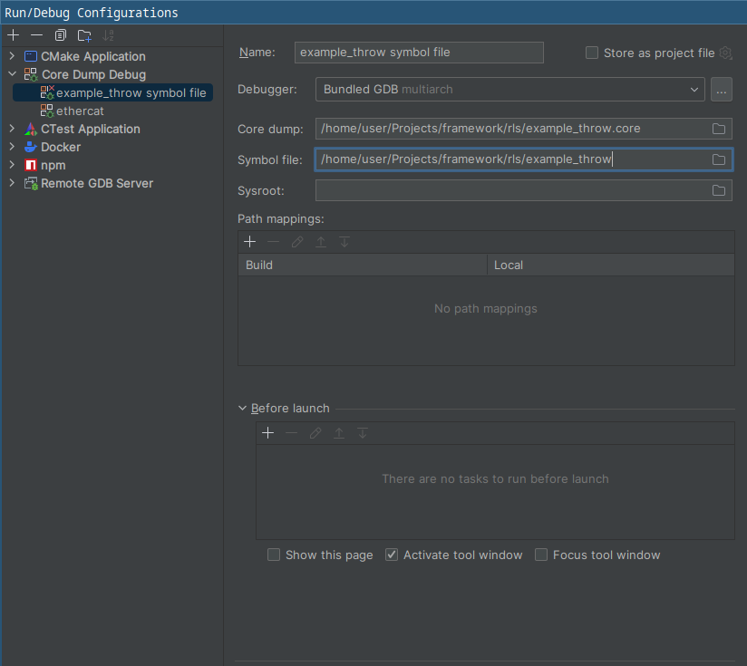

# Working with coredumps

Extract the coredump from the system:
```bash
$ coredumpctl -r list # find the pid of the crashed process
$ coredumpctl dump <pid> --output=<file-name>
```

Copy the release binary, debug file and the coredump to single directory, example:
```bash
$ cd framework # root of this project
$ mkdir dump && cd dump
$ ls  -alh
total 7.5M
drwxr-xr-x  2 user user 4.0K Feb  9 11:18 ./
drwxr-xr-x 17 user user 4.0K Feb  9 11:18 ../
-rwxr-xr-x  1 user user 508K Feb  9 11:01 example_throw*
-rw-r--r--  1 user user 528K Feb  9 11:17 example_throw.core
-rwxr-xr-x  1 user user 6.5M Feb  9 11:01 example_throw.sym*
```

Now you can use terminal to debug the coredump:
```bash
$ gdb ./example_throw ./example_throw.core
```

This will open the gdb terminal, notice that the debug file is loaded automatically:
```bash
Reading symbols from ./example_throw...
Reading symbols from /home/user/Projects/framework/rls/example_throw.sym...
```

The reason for this it is working is the debug link in the executable, which can be read with:
```bash
$ readelf -p .gnu_debuglink example_throw

String dump of section '.gnu_debuglink':
  [     0]  example_throw.sym
  [    14]  C?X
```

## Using CLion

Notice that the symbol file is the executable, the debug link will take care of the actual symbol file.



# Useful commands

## Find source location in binary
```bash
$ objdump -g ./example_throw | grep example_throw.cpp
```
